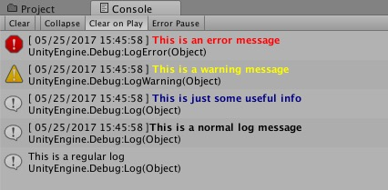

# UnityLogger
Simple replacement for the Debug.Log 


 Utility to send Debug log messages to console while in the editor, but hides in production.

If you need to show the debug messages outside of the editor, you can add a *Scripting Define Symbols* to the project.
To set the global define from the application menu:
 **EDIT** > **Project Settings** > **Player** 
Then enter the define name of `SHOW_DEBUG_MESSAGES` in the "*Scripting Define Symbols*" field. 

###### Example Usage
```
Logger.Log ("This is an error message", Logger.LOG_TYPE.Error);
Logger.Log ("This is a warning message", Logger.LOG_TYPE.Warning);
Logger.Log ("This is just some useful info", Logger.LOG_TYPE.Info);
Logger.Log ("This is a normal log message", Logger.LOG_TYPE.Log);
Logger.Log ("This is a regular log");
```


###### Console Output
